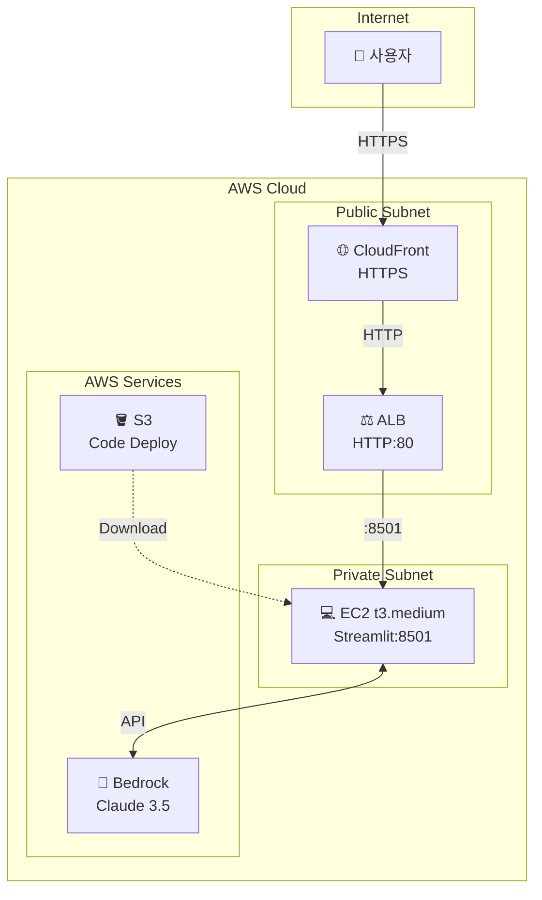

# AWS CDK 배포 가이드


> Stock AI Agent 애플리케이션을 AWS에 배포하기 위한 CDK 인프라 가이드입니다.

---

## 📚 목차

1. [빠른 시작](#-빠른-시작)
2. [인프라 구조](#-인프라-구조)
3. [사전 준비](#-사전-준비)
4. [배포 단계](#-배포-단계)
5. [문제 해결](#-문제-해결)
6. [비용 예상](#-비용-예상)
7. [주요 설정](#-주요-설정)
8. [보안](#-보안)
9. [리소스 삭제](#️-리소스-삭제)

---

## ⚡ 빠른 시작

```bash
# 1. CDK 디렉토리로 이동
cd cdk

# 2. 의존성 설치
npm install

# 3. Bootstrap (최초 1회)
cdk bootstrap aws://ACCOUNT-ID/us-east-1

# 4. 배포
cdk deploy

# 5. 출력된 CloudFront URL로 접속
# https://d1234567890.cloudfront.net
```

---

## 📦 인프라 구조



### 아키텍처 요약

| 구성 요소 | 역할 | 설명 |
|-----------|------|------|
| **CloudFront** | CDN / HTTPS | SSL 인증서, 캐싱, DDoS 방어 |
| **ALB** | 로드밸런서 | HTTP 트래픽 분산, 헬스체크 |
| **EC2** | 애플리케이션 서버 | Streamlit 앱 실행 |
| **Bedrock** | AI 서비스 | Claude 3.5 모델 호출 |
| **S3** | 코드 저장소 | 배포 코드 저장 |

---

## 🔧 사전 준비

### 필수 설치 항목

| 도구 | 설치 명령어 | 버전 확인 |
|------|-------------|-----------|
| AWS CLI | `brew install awscli` | `aws --version` |
| Node.js | `brew install node` | `node --version` |
| AWS CDK | `npm install -g aws-cdk` | `cdk --version` |
| TypeScript | `npm install -g typescript` | `tsc --version` |

### AWS 설정

```bash
# AWS 자격증명 설정
aws configure

# 설정 확인
aws sts get-caller-identity
```

### 프로젝트 의존성

```bash
cd cdk
npm install
```

---

## 🚀 배포 단계

### 1단계: CDK Bootstrap (최초 1회)

```bash
cdk bootstrap aws://ACCOUNT-ID/us-east-1
```

> **Note**: `ACCOUNT-ID`는 AWS 계정 ID로 대체하세요.

### 2단계: 코드 업로드 준비

#### 옵션 A: GitHub에서 클론 (권장)

`cdk/lib/stock-app-stack.ts` 파일 수정:
```typescript
'git clone https://github.com/YOUR_USERNAME/stock-app.git',
```

#### 옵션 B: S3에서 다운로드

```bash
# 코드 압축
zip -r stock-app.zip . -x "*.git*" -x "*node_modules*" -x "*cdk.out*" -x "*venv*"

# S3 업로드
aws s3 cp stock-app.zip s3://YOUR-BUCKET/stock-app.zip
```

UserData 수정:
```typescript
'aws s3 cp s3://YOUR-BUCKET/stock-app.zip /home/ec2-user/',
'cd /home/ec2-user && unzip stock-app.zip',
```

### 3단계: 환경 변수 설정 (선택)

추가 환경 변수가 필요한 경우 UserData에 추가:
```typescript
'export NOTION_API_KEY=your_key',
'export CUSTOM_VAR=value',
```

### 4단계: 배포 실행

```bash
cd cdk

# 변경사항 미리보기
cdk diff

# 배포 (승인 필요)
cdk deploy

# 자동 승인으로 배포
cdk deploy --require-approval never
```

### 5단계: 배포 확인

```bash
# 출력 예시
✅ StockAppStack

Outputs:
StockAppStack.CloudFrontUrl = https://d1234567890.cloudfront.net
StockAppStack.AlbDnsName = stock-app-alb-123456789.us-east-1.elb.amazonaws.com
```

### 6단계: 접속 테스트

```bash
# CloudFront URL 테스트
curl -I https://d1234567890.cloudfront.net

# 또는 브라우저에서 접속
open https://d1234567890.cloudfront.net
```

---

## 🔧 문제 해결

### EC2 인스턴스 접속 및 확인

```bash
# SSM Session Manager로 접속
aws ssm start-session --target i-1234567890abcdef0

# cloud-init 로그 확인
tail -f /var/log/cloud-init-output.log

# Streamlit 프로세스 확인
ps aux | grep streamlit

# Streamlit 수동 실행
cd /home/ec2-user/stock-app
source venv/bin/activate
streamlit run app.py --server.port 8501 --server.address 0.0.0.0
```

### ALB 헬스체크 확인

```bash
# Target Group 상태 조회
aws elbv2 describe-target-health --target-group-arn YOUR_TG_ARN
```

### 일반적인 문제와 해결책

| 문제 | 원인 | 해결책 |
|------|------|--------|
| 502 Bad Gateway | Streamlit 미실행 | EC2 접속 후 수동 실행 |
| 504 Gateway Timeout | 응답 시간 초과 | ALB 타임아웃 설정 증가 |
| 헬스체크 실패 | 포트 또는 경로 문제 | Security Group 확인 |
| Bedrock 오류 | IAM 권한 부족 | IAM Role 정책 확인 |

---

## 💰 비용 예상

### 월간 예상 비용

| 서비스 | 사양 | 예상 비용 (USD) |
|--------|------|-----------------|
| **EC2** | t3.medium (2 vCPU, 4GB) | ~$30 |
| **ALB** | Application Load Balancer | ~$20 |
| **NAT Gateway** | 데이터 처리 | ~$32 |
| **CloudFront** | 데이터 전송량 기준 | ~$5-10 |
| **Bedrock** | API 호출량 기준 | 사용량 따라 다름 |

### 총 예상 비용

```
기본 인프라: ~$82-92/월 + Bedrock 사용량
```

> **비용 절감 팁**:
> - 개발 환경에서는 `t3.micro` 또는 `t3.small` 사용
> - NAT Gateway 대신 NAT Instance 사용 고려

---

## 📝 주요 설정

| 설정 항목 | 값 | 설명 |
|-----------|-----|------|
| **Region** | us-east-1 | Bedrock 지원 리전 |
| **Instance Type** | t3.medium | 2 vCPU, 4GB RAM |
| **OS** | Amazon Linux 2023 | 최신 보안 패치 |
| **Python** | 3.11 | Streamlit 호환 버전 |
| **Streamlit Port** | 8501 | 기본 포트 |
| **ALB Port** | 80 | HTTP 트래픽 |
| **CloudFront** | HTTPS | 자동 HTTP→HTTPS 리다이렉트 |

---

## 🔐 보안

### 보안 구성

| 항목 | 설정 | 설명 |
|------|------|------|
| **EC2 위치** | Private Subnet | 인터넷에서 직접 접근 불가 |
| **ALB 위치** | Public Subnet | 유일한 진입점 |
| **HTTPS** | CloudFront 적용 | SSL/TLS 암호화 |
| **IAM Role** | EC2 Instance Role | Access Key 불필요 |
| **Security Group** | 포트 제한 | 필요한 포트만 허용 |

### Security Group 규칙

```
EC2 Security Group:
  Inbound:  TCP 8501 from ALB Security Group
  Outbound: All traffic (Bedrock API 호출용)

ALB Security Group:
  Inbound:  TCP 80 from 0.0.0.0/0
  Outbound: TCP 8501 to EC2 Security Group
```

### 권장 보안 강화

- [ ] WAF 적용 (SQL Injection, XSS 방어)
- [ ] CloudFront 지역 제한 설정
- [ ] VPC Flow Logs 활성화
- [ ] CloudTrail 로깅 활성화

---

## 🗑️ 리소스 삭제

### 전체 스택 삭제

```bash
cd cdk

# 삭제 전 확인
cdk diff

# 스택 삭제
cdk destroy
```

### 삭제 확인

```bash
# CloudFormation 스택 상태 확인
aws cloudformation describe-stacks --stack-name StockAppStack
```

> **주의**: S3 버킷에 객체가 있으면 삭제가 실패할 수 있습니다. 먼저 버킷을 비워주세요.

---

## 📎 참고 자료

- [AWS CDK 공식 문서](https://docs.aws.amazon.com/cdk/)
- [Amazon Bedrock 문서](https://docs.aws.amazon.com/bedrock/)
- [Streamlit 배포 가이드](https://docs.streamlit.io/deploy)

---

> 문제가 발생하면 이슈를 등록해주세요! 🚀
